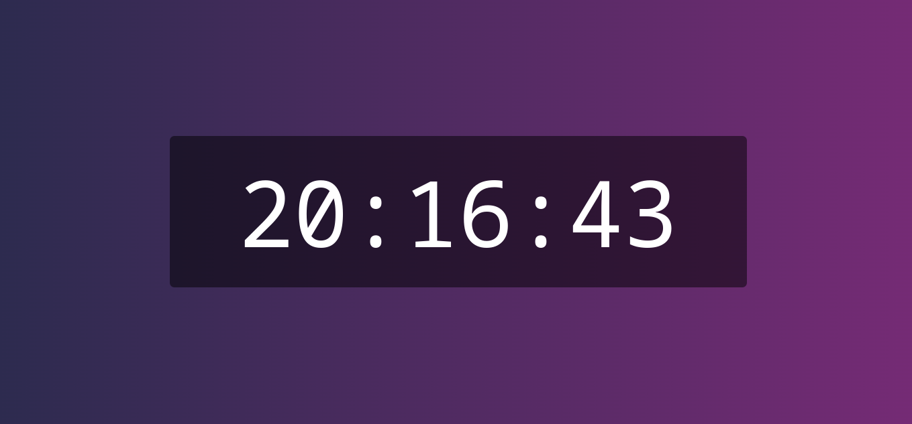
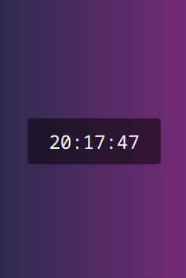

# Clock
The Simple Clock I’ve developed is a web application that provides a clean and easy-to-read time display. It’s perfect for any device, whether it’s a computer or mobile browser. The clock updates every second to ensure accurate timekeeping.

The design is minimalist with a monospace font and a gradient background that transitions from dark blue to purple. The time is displayed in a large font size that adjusts according to the viewport width, making it easily visible on all screen sizes.

This project combines web technologies (HTML, CSS, and JavaScript) to create a functional and user-friendly digital clock. ⏰🌐

And this is the result: 

- This is what it looks like on a PC with a resolution of 1920x1080:

 

- This is what it looks like on an iPhone SE with a resoution of 375x667:

